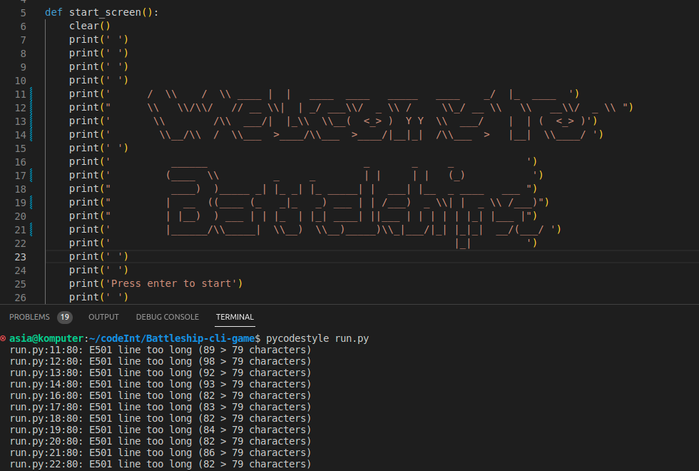

# **Battleship CLI** - Python deployed on Heroku

### [Live Webiste](https://python-battleship-cli-game.herokuapp.com/)

 

# Table of Contents 
* [Introduction](#introduction)
* [How To Play](#How-To-Play)
* [Features](#features)
* [UX](#ux)
* [Testing](#testing)
* [User Stories](#user-stories)
* [Credits](#credits)
* [Deployment](#deployment)

 

# Introduction  

**Time frame to finish this project was about 15-20 hours.** 

# How To Play

# Features 

# UX
# Testing
## Manual Testing

### Input testing - Placing boats

**Boat size 5 ■■■■■**
| Input      | Expected       | Result
| -----------| -------------  |------------- 
|   1,1      | Pass           | ✓
|   9,9      | Fail           | ✓
|   6,1      | Fail           | ✓
|   a,b      | Fail           | ✓
|   0,1      | Fail           | ✓
|   1,0      | Fail           | ✓
|   11       | Fail           | ✓
|   1,11     | Fail           | ✓
|   asd      | Fail           | ✓

**Boat size 1 ■**
| Input      | Expected       | Result
| -----------| -------------  |------------- 
|   1,1      | Pass           | ✓
|   9,9      | Pass           | ✓
|   6,1      | Pass           | ✓
|   a,b      | Fail           | ✓
|   0,1      | Fail           | ✓
|   1,0      | Fail           | ✓
|   11       | Fail           | ✓
|   1,11     | Fail           | ✓
|   asd      | Fail           | ✓

**Attempt to place boat on already taken up square**
Boat size | Input      | Expected       | Result
----------| -----------| -------------  |------------- 
5 ■■■■■| 1,1      | Pass           | ✓
4 ■■■■| 1,1      | Fail           | ✓
4 ■■■■| 2,1      | Fail           | ✓
4 ■■■■| 3,1      | Fail           | ✓
2 ■■| 6,1      | Pass           | ✓

**Attempt to place boat outside the grid**
Boat size | Input      | Expected       | Result
----------| -----------| -------------  |------------- 
5 ■■■■■| 5,1      | Pass           | ✓
5 ■■■■■| 6,1      | Fail           | ✓
5 ■■■■■| 0,1      | Fail           | ✓
5 ■■■■■| 5,5      | Fail           | ✓
4 ■■■■| 6,1      | Pass           | ✓
4 ■■■■| 7,1      | Fail           | ✓

### Input testing - Shooting boats
| Input      | Expected       | Result
| -----------| -------------  |------------- 
|   1,1      | Pass           | ✓
|   9,9      | Pass           | ✓
|   6,1      | Pass           | ✓
|   a,b      | Fail           | ✓
|   0,1      | Fail           | ✓
|   1,0      | Fail           | ✓
|   11       | Fail           | ✓
|   1,11     | Fail           | ✓
|   asd      | Fail           | ✓

Note - Shooting at the same already shoot square is a feature. In real life you can shoot multiple times at the same location so to keep my game realistic I have decided to let the user and the computer shoot at a already shot square if they choose to do so.

##  Validator Testing
### PEP8 testing
I have tested my python code with PEP8 validator to make sure it is up to highest standard and still easily readable. 
I have used **pycodestyle** library to help me find all the errors that I may have missed. I have decided to fix them all except a few that that would reduce the readability of the code if fixed. When choosing between readability and PEP8 guidelines I chose readability of the code. Those warnings are shown under the **Issues and Fixes** heading.

### Lighthouse testing

## Issues and Fixes 

### PEP8 Warnings
When choosing between readability and PEP8 guidelines I chose readability of the code. 
**Fallowing warnings appeared:**   

**Same warning with appropriate lines:**   

# User Stories
### Some of user stories that got completed 

| #           | User Story      
| ----------- | ------------- 
| 1           | As a user I want to be welcomed by a start screen with name of the game.
| 2           | As a user I want to see where my boat is placed after I enter coordinates.
| 3           | As a user I want to see the table so I can plan placing my boats.
| 4           | As a user I want to have more than one boat to place.
| 5           | As a user I want to have boats of different lengths to place .
| 6           | As a user I want to know why my input wasn't correct.
| 7           | As a user I want to see what squares have been shot by computer and me.
| 8           | As a user I want to know if I won or lost at the end.
| 9           | As a user I want to know if Im placing boat on another boat by accident.
| 10          | As a user I want to be warned that my boat is too long to be placed in certain positions.

 

### Some of user stories are planned for next sprint

| #           | User Story      
| ----------- | ------------- 
| 1           | As a user I want to hear sound when a boat is destroyed.
| 2           | As a user I want to see after how many shots I have won or lost.
| 3           | As a user I want to see some color on the terminal.
| 4           | As a user I want to see a leader board to see how I did compared to my friends.

# Credits

- [Background Image from pexels.com](https://www.pexels.com/)
- [pycodestyle - PEP8 validation](https://pypi.org/project/pycodestyle/)
- [Project template - Code Institute](https://github.com/Code-Institute-Org/python-essentials-template)

# Deployment

The project is deployed on Heroku. Heroku makes the deployment process super easy.

1. Create Heroku account.
1. Create new project.
1. Go into settings -> Config Var and add the fallowing:

    | key          | value     
    | ----------- | ------------- 
    | PORT        | 8000

1. Make sure to include fallowing buildpacks:
       
        * Heroku/python
        * Heroku/nodejs
    
     

1. In your project: create Prockfile with type of app (web in this case) and file name of main file to be ran first.
1. In your project: Create requirements.txt file  with
        
        pip3 freeze > requirements.txt

1. Deploy the project to GitHub with the fallowing files included.
1. On Heroku for Deployment Method pick Github and find the repo with the project you want to deploy.
1. Pick which branch you want to deploy -- in my case it was main
1. Click deploy and wait until the project is build, watch out for any errors.

